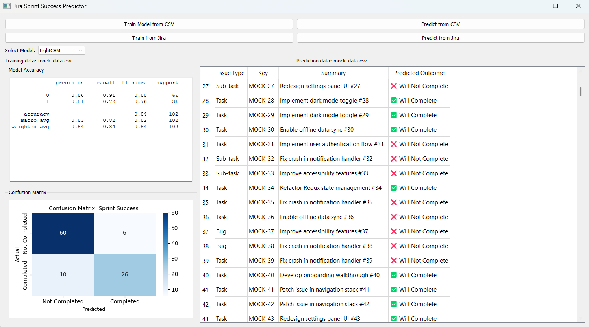

# Jira Sprint Success Predictor

[Building AI](https://buildingai.elementsofai.com/) course project

### AI Contribution

This project was developed with the assistance of generative AI. Approximately 95% of the content — including source code, documentation, and structural design — was generated using large language models.  
The human role focused on defining the problem, reviewing AI outputs, validating results, and guiding architectural decisions.

This approach is part of an exploration into AI-augmented software engineering workflows.

## Summary

A lightweight machine learning application that predicts the completion likelihood of planned Jira issues within a sprint. By leveraging historical data and model-driven insights, it helps agile teams make more realistic and informed planning decisions. The application includes a demo mode that works with CSV files, making it easy to explore without requiring Jira credentials.

## Background

Sprint planning in agile teams is a collaborative meeting to decide which tasks to complete in the upcoming sprint based on team capacity and priorities.

However, this critical step often faces several challenges:
* Difficulty in estimating which issues are realistically achievable within the sprint
* Overcommitting to too many tasks
* Failing to account for historical team performance

 I’ve seen firsthand how sprint planning often leads to overcommitment and missed deadlines. Jira, being one of the most widely used tools for tracking Agile development, provides rich data on issues, assignees, time estimates, and sprint history. This project uses that data with AI to predict task completion likelihood, helping teams plan more realistically and sustainably.

## How is it used?

The application can be used in two ways:

**Demo** - Works with CSV files:
   - Use the included `mock_data.csv` file to try out the application
   - Train the model and make predictions using CSV files
   - View predictions and model performance metrics
   - No Jira setup required
   - Use the "Train Model from CSV" button to load `mock_data.csv`
   - Use the "Predict from CSV" button to make predictions

**Jira Integration** - For teams using Jira:
   - Train the model with your team's historical sprint data
   - Get predictions for new sprint issues
   - Requires Jira credentials and API access




## Features

- 🤖 Machine learning model for sprint success prediction
- 📊 Visual model evaluation with confusion matrix
- 🎯 Issue-level sprint success prediction (yes/no outcome)
- 🖥️ Desktop GUI application
- 🔄 Optional Jira integration


## Data and AI techniques

The provided application uses two types of data:
1. CSV files
   - Use the included `mock_data.csv` for testing
   - Create your own CSV files with the same format

   #### Data Format
      The application expects CSV files with the following columns:
      - `issue_type`: Type of the issue (Task, Bug, Story, etc.)
      - `assignee`: Hashed identifier of the assignee
      - `original_estimate`: Time estimate for task in seconds
      - `was_in_previous_sprint`: Whether the task was in a previous sprint (0 or 1)
      - `days_in_sprint`: Number of days the task has been in the sprint
      - `comment_count`: Number of comments on the issue
      - `tasks_per_assignee`: Average number of tasks assigned to one person in the sprint
      - `sprint_success`: Whether the task was completed (only for training csv)
      - `key`: Issue key (only for predict csv)
      - `summary`: Issue summary (only for predict csv)

2. Jira data (optional)
   - Requires Jira credentials
   - Fetches data from your Jira instance
   - Option to save fetched data into CSV for later use

The model is trained on historical sprint data and can predict the probability of task completion. You can choose between four different machine learning models:

1. **Random Forest**: A tree-based model that's good for understanding feature importance
2. **XGBoost**: A gradient boosting model that often provides high prediction accuracy
3. **Neural Network**: A deep learning model that can capture complex patterns
4. **LightGBM**: A fast gradient boosting framework that's efficient with large datasets

You can switch between models using the dropdown menu in the application interface. 

## Challenges

This project does not account for unexpected disruptions such as team illness, changing priorities, or external dependencies. Prediction relies on historical data, which may reinforce existing biases or outdated practices. The model cannot assess task complexity or human factors like motivation or collaboration. It supports, but does not replace, human judgment in sprint planning. Its effectiveness also depends on the quality and consistency of Jira data.

## What next?

Future development possibilities:
1. Improve prediction accuracy
   - Add more features from Jira data
   - Try different machine learning models

2. Expand functionality
   - Support more project management tools
   - Add team capacity predictions
   - Include natural language analysis of issue descriptions

## Setup and Installation

### Prerequisites
- Python 3.8 or higher

### Quick Start 

1. Clone the repository:
```bash
git https://github.com/pkoisti/SprintPredictor.git
cd SprintPredictor
```

2. Create and activate a virtual environment:
```bash
python -m venv venv
source venv/bin/activate  # On Windows: venv\Scripts\activate
```

3. Install dependencies:
```bash
pip install -r requirements.txt
```

4. Run the application:
```bash
python desktop_app.py
```

### Optional: Jira Integration

To enable Jira integration, create a .env file containing your credentials and place it in the project root directory:
```
JIRA_DOMAIN=your-domain.atlassian.net
JIRA_EMAIL=your-email@company.com
JIRA_API_TOKEN=your-api-token
JIRA_PROJECT_KEY=YOUR_PROJECT  # Optional: limit to specific project
```

## Project Structure

```
SprintPredictor/
├── assets/                # project assets
├── data/                  # Sample and user data
├── src/                   # Source code modules
│   ├── data_processing.py
│   ├── jira_client.py
│   └── model.py
├── desktop_app.py         # Main application script
├── requirements.txt       # Python dependencies
├── README.md              # Project documentation
├── LICENSE                
└── .env                   # Place for Jira credentials (not included in repo)
```

## Security

- Jira credentials are stored in `.env` (not committed)
- Jira training data and models are excluded from git
- All API calls use secure authentication

## Acknowledgments

Building AI course by MinnaLearn and University of Helsinki

## Contributing

This project was developed as part of a personal learning initiative. If you have ideas or feedback, feel free to open an issue or contact the author.

## License

This project is licensed under the MIT License - see the [LICENSE](LICENSE) file for details. 
